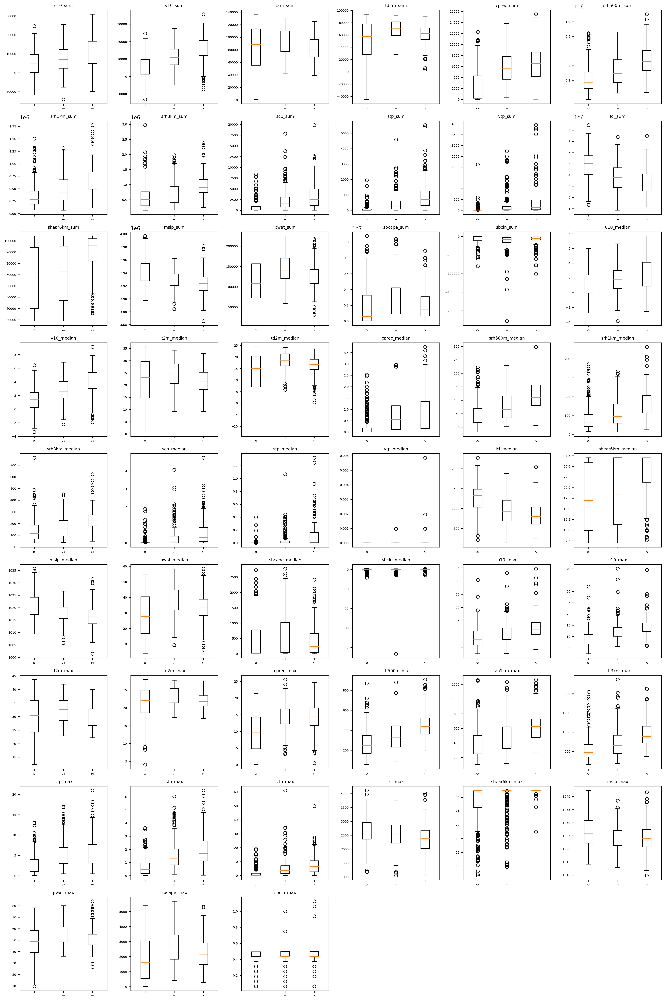
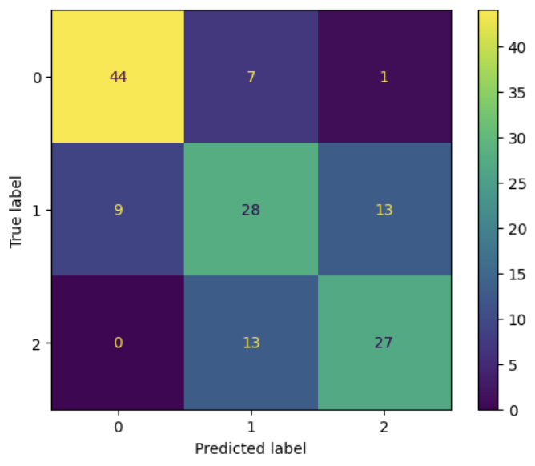
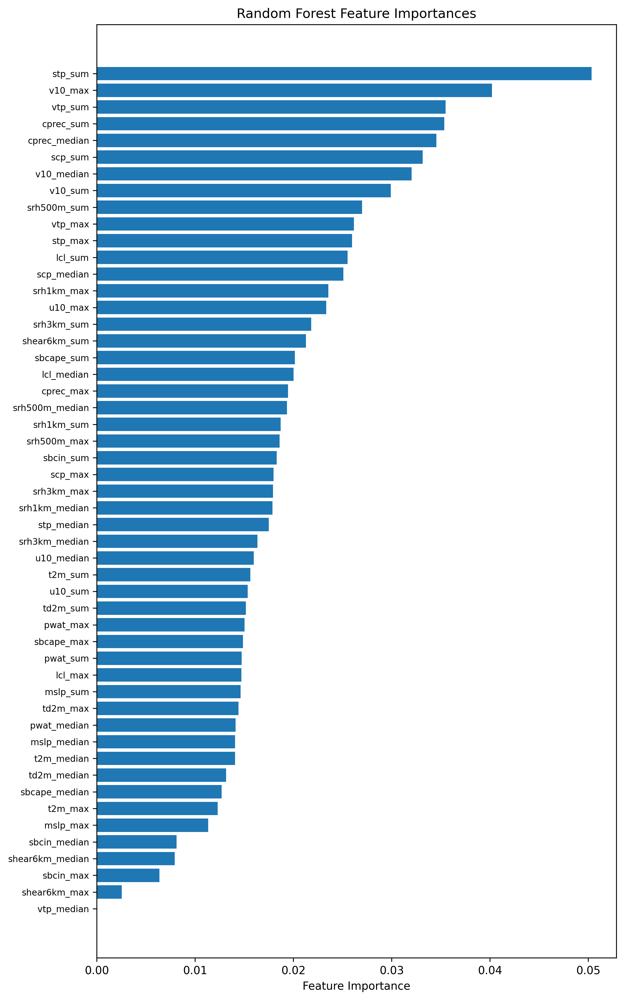

# A Random Forest Approach to Tornado-Day Forecasting in the Deep South

Authors: Brandon Weart, Daniel Wefer

### Data Download
The data for this project can be located on the Amazon Web Service (AWS) cloud server: https://registry.opendata.aws/noaa-gefs-reforecast/

And at: https://www.spc.noaa.gov/wcm/

These Python packages are required to run the code in this repository. 
* Pandas 
* Matplotlib 
* NumPy 
* Cartopy 
* Scikit-learn

### Data Analysis

Jupyter notebooks containing the code used to not only train the model, but produce the figures shown in this README can be found in this repository under the Notebooks folder. 

## 1. Introduction

Forecasting tornadoes with machine learning has become a major staple in the atmospheric science community (Gensini et al. 2020; 2021), and will continue to be ever so important as we advance our understanding of machine learning, as well as develop new techniques to forecast tornadoes. Tornadoes are notoriously difficult to forecast due to their still poorly understood dynamics, but a general subset of ingredients exists that can be used to varying degrees of success to predict environments conducive to tornadoes. Numerous studies have explored machine learning for use in predicting extreme weather or severe convective storms (Herman et al. 2018; Hill et al. 2022). For this project, a random forest model was utilized to attempt to find correlations with ingredients to different calibers of tornado days in the Deep South: days with no tornadoes, days with no significant tornadoes, and days with significant tornadoes. 

## 2. Data and Methods
#### Working with the data
Though we did not explicitly define thresholds for tornado days, we were able to extract days fitting thresholds defining non-tornado days, tornado days, and significant tornado days.

_Table 1: Tornado-day definitions_
| Category (label)        | Definition                                                                      |
|:------------------------|:--------------------------------------------------------------------------------|
| No-Tornado Day   (0)    | A day that does not exist within the SPC tornado report archive                 |
| Tornado Day      (1)    | A day when one or more tornadoes **below** EF-2 rating occurred                 |
| Significant Tornado Day (2) | A day when one or more tornadoes **at or above** EF-2 rating occurred           |

The temporal search period was from 2001 to 2019. Each of the days pulled was assigned labels based on the criteria defined (Table 1). In total, 259, 256, and 197 days were found for labels 0,1,2, respectively. This does not reflect the total number of days within the period being searched, as using the total number of days would create an unbalanced dataset that would prove detrimental to the model's performance, as a disproportionately large amount of 0s exist in the dataset since tornadoes are rare events. It is important to note that this search only gathered reports within out domain (Fig. 1).

After extracting the days from the SPC dataset, we utilized the Global Ensemble Forecast System (GEFS) reforecast dataset to represent the atmosphere for a given date. For each date, we used a subset of 17 variables arbitrarily determined to be associated with tornado-prone environments (Table 2).

_Table 2: Environmental variables extracted from GEFS at each grid cell_
| Abbreviation | Full Name                                           |
|--------------|-----------------------------------------------------|
| u10          | 10 m zonal (east–west) wind speed                   |
| v10          | 10 m meridional (north–south) wind speed            |
| t2m          | 2 m air temperature                                 |
| td2m         | 2 m dewpoint temperature                            |
| cprec        | Convective precipitation                            |
| srh500m      | 0–500 m storm-relative helicity                     |
| srh1km       | 0–1 km storm-relative helicity                      |
| srh3km       | 0–3 km storm-relative helicity                      |
| scp          | Supercell composite parameter                       |
| stp          | Significant tornado parameter                       |
| vtp          | Violent Tornado parameter                           |
| lcl          | Lifting condensation level                          |
| shear6km     | Bulk wind shear (surface–6 km)                      |
| mslp         | Mean sea level pressure                             |
| pwat         | Precipitable water                                  |
| sbcape       | Surface-based convective available potential energy |
| sbcin        | Surface-based convective inhibition                 |

This dataset is gridded and has multiple timesteps for each day. As we are using a random forest model, we need to convert this data into a tabular format. To do this, we extracted the max value over the time dimension at each grid cell, then took the sum, median, and max of those variables and appended them to a CSV for each date. There is an interesting correlation between the distribution of each variable for each label type (Fig. 2).

Before the model can be trained on the data, it needed to be split up into three different subsets: training, validation, testing. Training data is utilized to train the model initially and usually encompasses the largest portion of the data. The validation data is used as a sort of pseudo-test, and allows you to see the results of the model, and further tweak the hyperparameters of the model as the user sees fit. Scikit-learn has a built-in function to split the data into training and testing, so a workaround was utilized to create the validation dataset from a temporary subset. Utilizing the scikit-learn train-test split function (Scikit-learn 2025a), the data was first split into train and "temp", the temporary subset mentioned. The temporary subset contained 30% of the data. It was further split into validation and testing with a second iteration of the function, splitting the test to be 66% of the temp. The data was divided into 70%, 10%, and 20% for train, val, and test, respectively. 

## 3. Model configuration and results

To initialize the random forest model, we utilized Scikit-learn's RandomForestClassifier function (Scikit-learn 2025b). After modifying the hyperparameters, the best model configuration was found to be a model with 64 estimators flat. Other attempts included changing max depth, adding warm start, and other amounts of estimators, but for some reason, this amount of estimators in particular performed the best with no additional hyperparameter tuning. 

The model performs relatively well (Fig. 3), especially with 0 labels, as only 9 of the 53 within the testing subset were mislabeled. Overall, the model has more correct than incorrect predictions for each label, which is generally a good outcome. 

_Table 3: Statistics_
| Label             | Precision | Recall | F1-Score | Support |
|-------------------|-----------|--------|----------|---------|
| 0                 | 0.83      | 0.85   | 0.84     | 52      |
| 1                 | 0.58      | 0.56   | 0.57     | 50      |
| 2                 | 0.66      | 0.68   | 0.67     | 40      |
| **accuracy**      |           |        | 0.70     | 142     |
| **macro avg**     | 0.69      | 0.69   | 0.69     | 142     |
| **weighted avg**  | 0.69      | 0.70   | 0.70     | 142     |

It can be seen (Table 3) that the model has an 83% precision for 0 labels, with 58 and 66% for 1 and 2 respectively. Total accuracy is ~70%, which is much better than random chance, and shows that the model as some skill at least able to effectively correlate some of the variables with the labels. Our recall and F1 scores vary little from the precision. 

Looking at the feature importance is critical as it gives us an idea of how the model utilized the features passed into it and how important they were in the classification process. Out of the 51 predictors, sum_stp performed the best by a large amount. This makes sense due to the fact that STP, though being a composite parameter, gives a general summary of the environment based on variables such as CAPE and SRH and shear, which are essential to tornadoes, and summing it up over the entire domain gives a great idea of how widespread the potential for a tornado might be, and the higher the sum, the higher the STP values per grid cell, meaning a more robust environment. 

## 4. Summary

This project examines the ability of a random forest model to classify tornado days based on environmental parameters within the Deep South CONUS. Dates are found via the SPC storm report archive and matched with their predicted environment, 17 unique, and 51 iterations of those 17 unique variables via GEFS reforecast data.

Model accuracy is possible, beating out random chance by an okay margin, but it needs work, to say the least. One of the significant issues with the dataset used is the unbalanced nature, which prevents us from utilizing the entire dataset. This is because tornadoes are relatively rare events. The model is 70% accurate overall, and is notably accurate at predicting zero labels, with 83% precision, 85% recall, and 84% F1-score all showing great performance. The model performed worse with one and two labels. 

To improve this model, I would likely utilize ERA5 reanalysis data so that our temporal range can be significantly expanded, and so our grid spacing is a bit tighter, giving us a better idea of variability over the domain. Future work may also include a bit more hyperparameter tuning to try and get the best model possible. 

## 5. References
Gensini, V. A., C. Converse, W. S. Ashley, and M. Taszarek, 2021: Machine Learning Classification of Significant Tornadoes and Hail in the United States Using ERA5 Proximity Soundings. Weather and Forecasting, 2143-2160, https://doi.org/10.1175/WAF-D-21-0056.1.

Scikit-learn Tuning the hyper-parameters of an estimator,. scikit-learn. Accessed 4 May 2025a, https://scikit-learn/stable/modules/grid_search.html.

Scikit-learn RandomForestClassifier,. scikit-learn. Accessed 4 May 2025b, https://scikit-learn/stable/modules/generated/sklearn.ensemble.RandomForestClassifier.html.

Gensini, V. A., C. Converse, W. S. Ashley, and M. Taszarek, 2021: Machine learning classification of significant tornadoes and hail in the U.S. using ERA5 proximity soundings. Weather and Forecasting, https://doi.org/10.1175/waf-d-21-0056.1.

Hill, A. J., R. S. Schumacher, and I. L. Jirak, 2022: A new paradigm for Medium-Range Severe Weather forecasts: Probabilistic Random Forest–Based predictions. Weather and Forecasting, 38, 251–272, https://doi.org/10.1175/waf-d-22-0143.1.

## 6. Appendix

# Requirements Document
We identified the following requirements for this project:

| Field               | TOR_AI-01 |
|---------------------|-----------|
| Title               | Curation of a list of possible data sources for training/testing/validation data to train the model. |
| Priority            | High |
| Sprint              | 1 |
| Assigned to         | Daniel Wefer |
| User Story          | As developers of this product, we need to find strong data, so that we can classify events and build a 4-day tornadic environment classification algorithm. |
| Requirement         | The dataset must be in a format that can be used to train a model. The dataset must contain variables that are useful in the context of severe convective storm (SCS) analysis. The model data must be reliable up to 4 days out. |
| Acceptance Criteria | The model data must be gridded and the tornado data must have latitude, longitude, magnitude, and temporal information. The model data must contain CAPE, CIN, 0-6 km bulk shear, 0-1 km SRH, and temperature/dewpoint values. Must be an ensemble reanalysis dataset. |
| Automated Test      | Check the size of the files and verify they are reasonable given our resources. Read source documentation to confirm format and required variables are present. Import and parse the data, asserting access to all required variables. |
| Status              | Complete |

| Field               | TOR_AI-02 |
|---------------------|-----------|
| Title               | Procurement of the necessary data for our model |
| Priority            | High |
| Sprint              | 1 |
| Assigned to         | Brandon Weart |
| User Story          | As developers of this product, we need to find data to train and develop our model and also work on procuring the proper data for our project. |
| Requirement         | Must be viable for the basis of this project and be usable without investment of significant time and processing power. |
| Acceptance Criteria | Must already be on TRITON/CIRRUS. Data must contain the variables relevant to our mission statement. |
| Automated Test      | Test if file imports properly. Use an xarray plot and visually inspect to ensure correct import. |
| Status              | Complete |

| Field               | TOR_AI-03 |
|---------------------|-----------|
| Title               | Create a confusion matrix function for our algorithm |
| Priority            | High |
| Sprint              | 2 |
| Assigned to         | Daniel Wefer |
| User Story          | As developers of this product, we need to evaluate the accuracy of our algorithm’s classifications, so that we can assess its strengths and weaknesses, as well as its overall skill level. |
| Requirement         | Accurately assesses the algorithm’s output. |
| Acceptance Criteria | General results should match intuitive knowledge on the parameters being used. Must be based on valid statistical methods. |
| Automated Test      | Assert that input data types are correct. Visually assess the contingency matrix output for correctness. |
| Status              | Complete |

| Field               | TOR_AI-04 |
|---------------------|-----------|
| Title               | Determine necessary variables for our algorithm |
| Priority            | High |
| Sprint              | 1 |
| Assigned to         | Brandon Weart |
| User Story          | As developers of this model, we need to determine which variables to use so that we can successfully train a random forest model to classify medium-range tornadic environments. |
| Requirement         | Variables must be useful in our mission to diagnose mid-range tornadic environments using the GEFS reanalysis dataset. |
| Acceptance Criteria | Variables included must improve output accuracy. Variables included must make intuitive meteorological sense. Necessary variables must be available in our reanalysis dataset. |
| Automated Test      | Include different variables in our algorithm and measure accuracy improvements. |
| Status              | Complete |

| Field               | TOR_AI-05 |
|---------------------|-----------|
| Title               | Create time intervals for training, validation, and testing data |
| Priority            | High |
| Sprint              | 1 |
| Assigned to         | Brandon Weart |
| User Story          | We need to create three subsets of data based on the data we already possess to train, validate, and test the model. Training and validation can be manipulated, but testing must remain untouched after selection. Years should not overlap. |
| Requirement         |  |
| Acceptance Criteria | Have 30 of each classification for training and 10 of each classification for both validation and testing. Ensure data is in the correct format (e.g., pickle files) and properly analyzed before use. |
| Automated Test      | Assert that each subset has the correct size and classification counts. |
| Status              | Complete |

| Field               | TOR_AI-06 |
|---------------------|-----------|
| Title               | Train our algorithm |
| Priority            | High |
| Sprint              | 2 |
| Assigned to         | Both |
| User Story          | As developers of this product, we need to train our model to succeed in our mission statement. |
| Requirement         | Shows meaningful skill at classifying tornadic environments 4 days out. |
| Acceptance Criteria | Is not overtrained. Has at least a 70% precision and recall score. |
| Automated Test      | Feed reanalysis data into the algorithm, then compute precision and recall to verify output meets targets. |
| Status              | Complete |

| Field               | TOR_AI-07 |
|---------------------|-----------|
| Title               | Decide on an algorithm type |
| Priority            | High |
| Sprint              | 1 |
| Assigned to         | Brandon Weart |
| User Story          | As developers of this product, we need to choose an algorithm that can ingest tabular data from flattened model output in order to successfully classify tornadic environments in Dixie Alley. |
| Requirement         | Must be capable of classifying environments based on tabular data passed in. |
| Acceptance Criteria | Is an algorithm that makes sense with our data format. Has been successful in previous experiments on similar topics. |
| Automated Test      | Ensure output is reasonable. Test results against the SPC’s tornado dataset. |
| Status              | Complete |

| Field               | TOR_AI-08 |
|---------------------|-----------|
| Title               | Plot the contingency table metrics and other output of the function (Statistics) |
| Priority            | Medium |
| Sprint              | 2 |
| Assigned to         | Brandon Weart |
| User Story          | As developers of our project, it is important to visualize the statistical output so we can analyze how our model performed. |
| Requirement         |  |
| Acceptance Criteria | Visualize using ROC curves or Brier skill score metrics. Make plots showing model accuracy over epochs. Plot contingency table data. |
| Automated Test      | Create a function to clean bad data (NaNs), calculate skill scores, and verify calculations. Pass contingency tables in binary format to ensure proper plotting. |
| Status              | Complete |

| Field               | TOR_AI-09 |
|---------------------|-----------|
| Title               | Classify our tornado events |
| Priority            | High |
| Sprint              | 2 |
| Assigned to         | Daniel Wefer |
| User Story          | As developers of this machine learning model, we need to classify various events in order to train and verify our results. |
| Requirement         | Must classify the severity of tornadic environments. |
| Acceptance Criteria | Must have binary classification. Must separate weak tornadoes from strong tornadoes. Must separate tornado days from non-tornado days. |
| Automated Test      | When classifying days, assert that each day’s label matches the expected classification. |
| Status              | Complete |

| Field               | TOR_AI-10 |
|---------------------|-----------|
| Title               | Attempt a real-time forecast with our model |
| Priority            | Low |
| Sprint              | Final |
| Assigned to         | Daniel Wefer |
| User Story          | As developers of this product, we should test operational skill on real events to see if the model has appreciable predictive ability. |
| Requirement         | Classify a real day’s 4-day environment in real time. |
| Acceptance Criteria | Successfully determine if a real-time environment will be tornadic, significant tornadic, or non-tornadic. Successfully ingest operational real-time GEFS data. |
| Automated Test      | Ensure live data ingestion does not error. Reuse unit tests for prior aspects and compare model output to storm reports after the event. |
| Status              | Complete |
